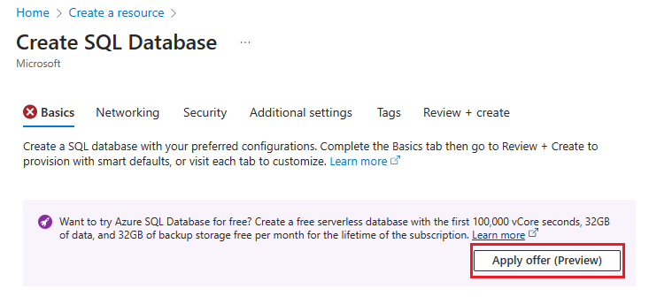
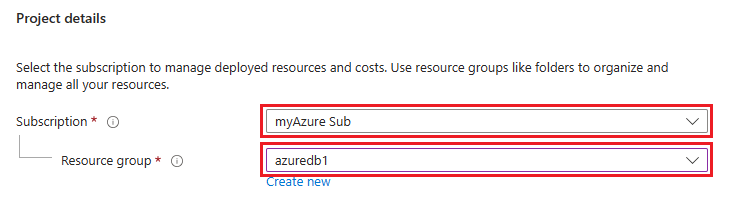
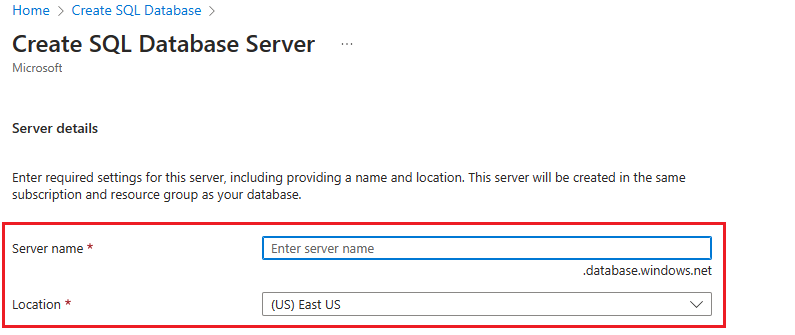
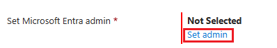
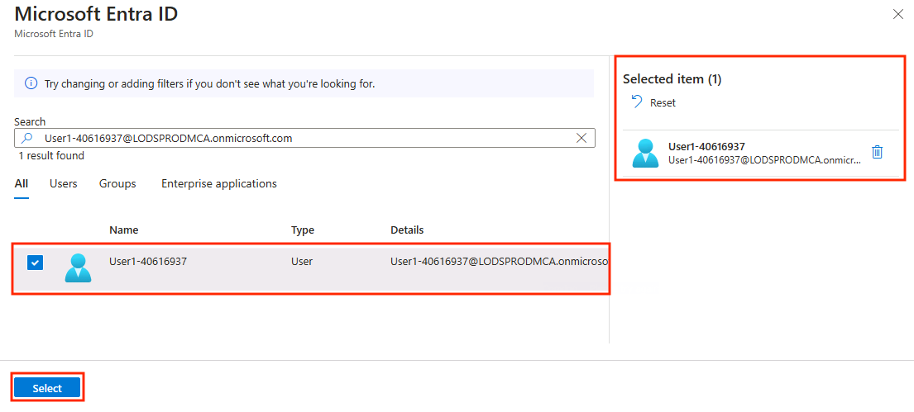
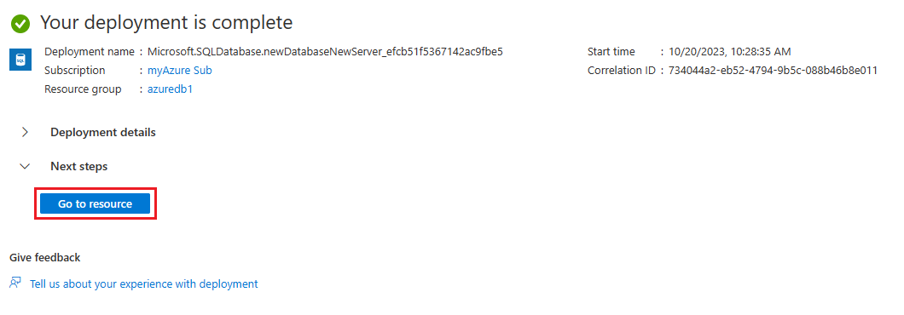
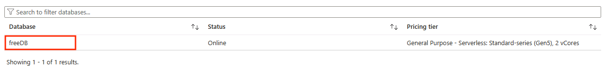
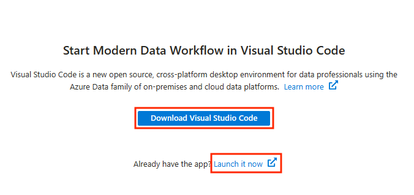
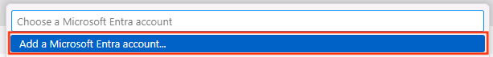
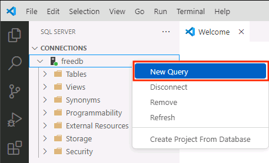

# Create and Connect to an Azure SQL Database

The next section of the workshop you will be creating and connecting to an Azure SQL Database.

## Azure SQL Database create and connect workshop tasks

### Create a free Azure SQL Database

1. Ensure you have an Azure account to log into the Azure Portal. Need a free account? Sign up for one [here](https://azure.microsoft.com/en-us/free).

1. Navigate to the [Azure Portal](https://portal.azure.com/#home), and in the upper left corner, click the menu button.

    

1. Then, select **Create a Resource**.

    

1. In the category menu, select **Databases**.

    

1. Then click **create** for **SQL Database**.

    

1. On the **Create SQL Database** page, click the **Apply offer (Preview)** button for the free Azure SQL Database.

    

1. In the **Project details** section of the page, select a subscription and a Resource group if you have an existing one. 

    

    Otherwise you can create a Resource group by clicking the **Create new** button.

    

1. Next, in the **Database details** section of the page, name your database **freeDB** with the **Database name** field.

    

1. For the **Server**, click the **Create new** button.

    

1. On the **Create SQL Database Server** page, enter a **server name** and choose a **Location** using the dropdown menu.

    

1. Now, in the **Authentication** section, select the **radio button** for **Use Microsoft Entra-only authentication**.

    

1. Click the **Set admin** link in the **Set Microsoft Entra admin** section. 

    

1. Using the **Microsoft Entra ID** blade, find your user account and select it as an admin. Then click the **Select** button on the bottom left.

    

1. Click the **OK** button on the bottom left of the page.

    

1. Back on the **Create a SQL Database** page, verify the values you entered and that the free database offer has been applied. 

    

1. On the top of the page, click on the **Additional settings** tab.

    

1. On the Additional settings page, find the **Data source** section on the top.

    

1. Use the **Use existing data** toggle

    

    to set it to **Sample** by clicking on it.

    

    and in the pop-up doalog, select **OK** for the question **"Do you want to continue"**.

    

1. On the bottom of the page in the lower left, click the **Review + create** blue button.

    

1. On the following page, click the **Create** button in the lower left.

    

1. The following page will detail the deployments progress.

    

1. Once the deployment is done, click the blue **Go to resource** button to see your database details.

    

#### Network access to the database

1. On the database details page, the right hand side, you will see the **Server name** field with a link the your database server. Click the server name link.

    

1. Click the **Networking** link on the left hand side menu in the **Security** section.

    

1. On the **Networking** page, click the **radio button** next to **Selected networks**.

    

1. In the **Firewall rules** section, click the button labeled **"Add your client IPv4 address (X.X.X.X)"** to add your local IP address for database access.

    

1. Click the **checkbox** for **Allow Azure services and resources to access this server** in the **Exceptions** section.

    

1. Finally, click the **Save** button in the lower left of the page.

    

### Connect to the free Azure SQL Database

#### Option 1: Using the Query Editor in the Azure Portal

1. Using the menu on the left side, open the menu items under **Settings** if not alreay opened. Then select **SQL Databases** by clicking on it.

    

1. Next, on the main page, find the FreeDB you created and click on it naviage to the database details page.

    

1. Using the menu options on the left side, find and click on **Query editor (preview)**.

    

1. Next, click on the blue **Continue as ...** (with ... being the user you set as the database admin upon creation) in the Microsoft Entra authentication section.

    

1. The Query Editor will be used in the following chapters for running T-SQL code and procedures.

    

#### Option 2: Using Azure Data Studio

1. Azure Data Studio is another option for working with the database with a dedicated client tool. To use this tool, start on the main page, **Getting Started** tab for the database details. Here click on the blue **Open Azure Data Studio** button.

    

1. On the following page, if Azure Data Studio is not installed, click on the blue **Download Azure Data Studio** button to start that process. If it is already installed or was just installed, click on the **Launch it now** link.

    

1. The link will launch Azure Data Studio and pre-create a database connection profile with the database details for the Azure SQL Database that was just created. Start by changing the **Authentication Type** to **Microsoft Entra ID**.

    

1. For the **Account** field, if you have been authenticated previously, an email address will be present. Select your email address for the account field. Once the profile is filled out, click the blue **Connect** button.

    

1. If no account has been set/logged in, select the **Add an account** option and authenticate via the Azure portal.

    

1. Once connected to the database, right click on the connection name in the connection navigator on the left side and choose **New Query**.

    

