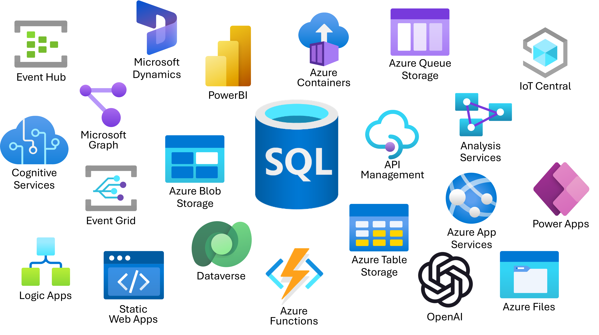
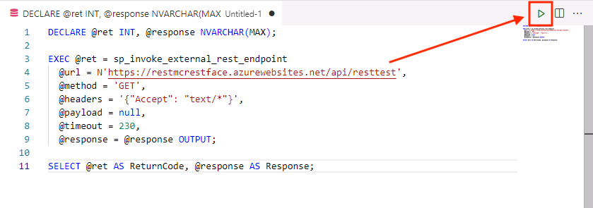
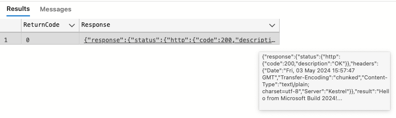

# Call REST services from the Azure SQL Database with External REST Endpoint Invocation



## External REST Endpoint Invocation

Azure SQL Database External REST Endpoint Invocation provides the ability to call REST endpoints from other Azure services such as OpenAI, communications, Azure Functions, PowerBI and more. Common use cases for developers to use External REST Endpoint Invocation are:

* Ability to push business logic out of the database and into Azure Functions
* Pull/push data to/from external sources (including Azure Blob Storage) for ETL or derived data stores
* Participate in event based architectures with Azure Event Hub or Kafka

External REST Endpoint Invocation can be called in an Azure SQL Database using the sp_invoke_external_rest_endpoint stored procedure. The following exercises and examples will guide you through calling various Azure Services and seeing how you can integrate REST into your applications and database development implementations.

# Getting started with REST in the Azure SQL Database

In this section, you will test the External REST Endpoint Invocation (EREI) feature of the database to ensure you have connectivity to other Azure services by calling an Azure Function. 

**Important!** The response message will also contain the keys to be used for authentication in the next two chapters. Be sure to copy them and keep them where you can refer to them later in the workshop.

### Using T-SQL to check connectivity to Azure Services

1. Using the chosen T-SQL editor (Query Editor, Azure Data Studio, etc), copy and paste the following code:

    ```SQL
    DECLARE @ret INT, @response NVARCHAR(MAX);

    EXEC @ret = sp_invoke_external_rest_endpoint
      @url = N'https://restmcrestface.azurewebsites.net/api/resttest',
      @method = 'GET',
      @headers = '{"Accept": "text/*"}',
      @payload = null,
      @timeout = 230,
      @response = @response OUTPUT;

    SELECT @ret AS ReturnCode, @response AS Response;
    ```

1. Once the code is in the editor, execute it by clicking the **Run** button.

    

1. Hover over the results to see the response message. It should look similar to the following.

      ```JSON
      {
          "response": {
              "status": {
                  "http": {
                      "code": 200,
                      "description": "OK"
                  }
              },
              "headers": {
                  "Date": "Fri, 03 May 2024 15:50:37 GMT",
                  "Transfer-Encoding": "chunked",
                  "Content-Type": "text\/plain; charset=utf-8",
                  "Server": "Kestrel"
              }
          },
          "result": "Hello from Microsoft Build 2024! The AI Language Key is XXXXXXXXX. The Content Safety Key is XXXXXXXXX"
      }
      ```

    

1. Copy these keys because it will be used in upcoming sections of this workshop. Here they are represented here as XXXXXXXXX, but the keys presented to you will be a longer string of numbers and letters.