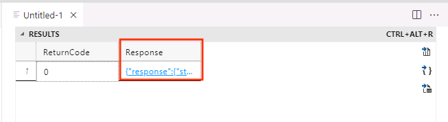

# Getting started with REST in the Azure SQL Database

In this section, you will test the External REST Endpoint Invocation (EREI) feature of the database to ensure you have connectivity to other Azure services like Azure Functions, AI Language and Content Safety.

## Testing EREI

### Using T-SQL to check connectivity to Azure Services

1. Using the chosen T-SQL editor (Query Editor, Azure Data Studio, etc), copy and paste the following code:

    ```SQL
    DECLARE @ret INT, @response NVARCHAR(MAX);

    EXEC @ret = sp_invoke_external_rest_endpoint
      @url = N'https://restmcrestface.azurewebsites.net/api/resttest',
      @method = 'GET',
      @headers = '{"Accept": "text/*"}',
      @payload = null,
      @timeout = 230,
      @response = @response OUTPUT;

    SELECT @ret AS ReturnCode, @response AS Response;
    ```

1. Once the code is in the editor, execute it by clicking the **Run** button.

    

1. Hover over the results to see the response message. It should look similar to the following.

      ```JSON
      {
          "response": {
              "status": {
                  "http": {
                      "code": 200,
                      "description": "OK"
                  }
              },
              "headers": {
                  "Date": "Fri, 03 May 2024 15:50:37 GMT",
                  "Transfer-Encoding": "chunked",
                  "Content-Type": "text\/plain; charset=utf-8",
                  "Server": "Kestrel"
              }
          },
          "result": "Hello from Microsoft Build 2024!"
      }
      ```

    