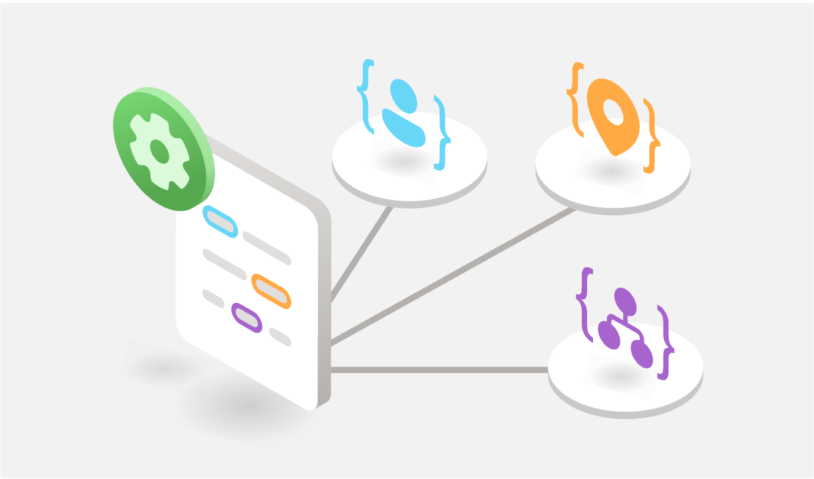

# Using the Azure AI Language Service



## Azure AI Language Service

Azure AI Language is a cloud-based service that provides Natural Language Processing (NLP) features for understanding and analyzing text. Use this service to help build intelligent applications using the web-based Language Studio, REST APIs, and client libraries.

### Available features

Language Studio enables you to use the below service features without needing to write code.

| AI Language Feature        | Description    |
| -------------------------- | ------------- |
| Named Entity Recognition (NER) | Named entity recognition is a preconfigured feature that categorizes entities (words or phrases) in unstructured text across several predefined category groups. For example: people, events, places, dates, and more.|
| Personally identifying (PII) and health (PHI) information detection | PII detection is a preconfigured feature that identifies, categorizes, and redacts sensitive information in both unstructured text documents, and conversation transcripts. For example: phone numbers, email addresses, forms of identification, and more.|
| Language detection | Language detection is a preconfigured feature that can detect the language a document is written in, and returns a language code for a wide range of languages, variants, dialects, and some regional/cultural languages.|
| Sentiment Analysis and opinion mining | Sentiment analysis and opinion mining are preconfigured features that help you find out what people think of your brand or topic by mining text for clues about positive or negative sentiment, and can associate them with specific aspects of the text.|
| Summarization | Summarization is a preconfigured feature that uses extractive text summarization to produce a summary of documents and conversation transcriptions. It extracts sentences that collectively represent the most important or relevant information within the original content.|
| Key phrase extraction | Key phrase extraction is a preconfigured feature that evaluates and returns the main concepts in unstructured text, and returns them as a list.|
| Entity linking | Entity linking is a preconfigured feature that disambiguates the identity of entities (words or phrases) found in unstructured text and returns links to Wikipedia.|
| Text analytics for health | Text analytics for health is a preconfigured feature that extracts and labels relevant medical information from unstructured texts such as doctor's notes, discharge summaries, clinical documents, and electronic health records.|
| Custom text classification | Custom text classification enables you to build custom AI models to classify unstructured text documents into custom classes you define.|
| Custom Named Entity Recognition (Custom NER) | Custom NER enables you to build custom AI models to extract custom entity categories (labels for words or phrases), using unstructured text that you provide.|
| Conversational language understanding | Conversational language understanding (CLU) enables users to build custom natural language understanding models to predict the overall intention of an incoming utterance and extract important information from it.|
| Orchestration workflow | Orchestration workflow is a custom feature that enables you to connect Conversational Language Understanding (CLU), question answering, and LUIS applications.|
| Question answering | Question answering is a custom feature that finds the most appropriate answer for inputs from your users, and is commonly used to build conversational client applications, such as social media applications, chat bots, and speech-enabled desktop applications.|
| Custom text analytics for health | Custom text analytics for health is a custom feature that extract healthcare specific entities from unstructured text, using a model you create.|

**Table 1:** Azure AI Language Features

# Getting started with Azure AI Language Service and REST in the Azure SQL Database

In this section, you will use Azure AI Language Service with the External REST Endpoint Invocation (EREI) feature of the database to call various endpoints to see how data in the database can be paired with AI features.

## PII and Redaction

The first endpoint we will use is the Personally Identifiable Information (PII) detection service. The PII detection feature can identify, categorize, and redact sensitive information in unstructured text. For example: phone numbers, email addresses, and forms of identification. 

1. Copy the following SQL and paste it into the SQL query editor.

    ```SQL
    declare @url nvarchar(4000) = N'https://languagebuild2024.cognitiveservices.azure.com/language/:analyze-text?api-version=2023-04-01';
    declare @headers nvarchar(300) = N'{"Ocp-Apim-Subscription-Key":"LANGUAGE_KEY"}';
    declare @payload nvarchar(max) = N'{
        "kind": "PiiEntityRecognition",
        "analysisInput":
        {
            "documents":
            [
                {
                    "id":"1",
                    "language": "en",
                    "text": "abcdef@abcd.com, this is my phone is 6657789887, and my IP: 255.255.255.255 127.0.0.1 fluffybunny@bunny.net, My Addresses are 1 Microsoft Way, Redmond, WA 98052, SSN 543-55-6654, 123 zoo street chickenhouse, AZ 55664"
                }
            ]
        }
    }';

    declare @ret int, @response nvarchar(max);

    exec @ret = sp_invoke_external_rest_endpoint 
        @url = @url,
        @method = 'POST',
        @headers = @headers,
        @payload = @payload,
        @timeout = 230,
        @response = @response output;

    select @ret as ReturnCode, @response as Response;
    ```

1. Replace the **LANGUAGE_KEY** text with the AI Language Key that was returned to you in the previous chapter when testing connectivity.

1. Execute the SQL statement with the run button.

1. View the return message. Points you will want to examine are where the text came back with all PII redacted and the section where each piece of PII is categorized.

    ```JSON
    "redactedText": "***************, this is my phone is **********, and my IP: *************** ********* *********************, My Addresses are **********************************, SSN ***********, *************************************",
    "id": "1",
    "entities": [
        {
            "text": "abcdef@abcd.com",
            "category": "Email",
            "offset": 0,
            "length": 15,
            "confidenceScore": 0.8
        },
        {
            "text": "6657789887",
            "category": "EUTaxIdentificationNumber",
            "offset": 37,
            "length": 10,
            "confidenceScore": 0.93
        },
        {
            "text": "255.255.255.255",
            "category": "IPAddress",
            "offset": 60,
            "length": 15,
            "confidenceScore": 0.8
        },
        {
            "text": "127.0.0.1",
            "category": "IPAddress",
            "offset": 76,
            "length": 9,
            "confidenceScore": 0.8
        },
        {
            "text": "fluffybunny@bunny.net",
            "category": "Email",
            "offset": 86,
            "length": 21,
            "confidenceScore": 0.8
        },
        {
            "text": "1 Microsoft Way, Redmond, WA 98052",
            "category": "Address",
            "offset": 126,
            "length": 34,
            "confidenceScore": 1.0
        },
        {
            "text": "543-55-6654",
            "category": "USSocialSecurityNumber",
            "offset": 166,
            "length": 11,
            "confidenceScore": 0.85
        },
        {
            "text": "123 zoo street chickenhouse, AZ 55664",
            "category": "Address",
            "offset": 179,
            "length": 37,
            "confidenceScore": 0.95
        }
    ],
    ```

### Answer Questions

The Answer Questions capability attempts to extract the answer to a given question from the passage of text provided. Extract questions and answers from your semi-structured content, including FAQs, manuals, database data, and documents.

1. Copy the following SQL and paste it into the SQL query editor. This example uses a description from the Adventure Works ProductDescription table to seed the session.

    ```SQL
    declare @url nvarchar(4000) = N'https://languagebuild2024.cognitiveservices.azure.com/language/:query-text?api-version=2023-04-01';
    declare @headers nvarchar(300) = N'{"Ocp-Apim-Subscription-Key":"xxxxxxx"}';
    declare @message nvarchar(max);
    SET @message = (SELECT [Description]
                    FROM [SalesLT].[ProductDescription]
                    WHERE ProductDescriptionID = 457);
    declare @payload nvarchar(max) = N'{
    "question": "What is the bike made from?",
    "records": [
        {
        "id": "1",
        "text": "'+ @message +'"
        }
    ],
    "language": "en"
    }';

    declare @ret int, @response nvarchar(max);

    exec @ret = sp_invoke_external_rest_endpoint 
        @url = @url,
        @method = 'POST',
        @headers = @headers,
        @payload = @payload,
        @timeout = 230,
        @response = @response output;

    select @ret as ReturnCode, @response as Response;
    ```

1. Replace the **LANGUAGE_KEY** text with the AI Language Key that was returned to you in the previous chapter when testing connectivity.

1. Execute the SQL statement with the run button.

1. View the return message. You can see the confidence score for each answer as to how it feels it performed based on the text provided and the question asked.

    ```JSON
    "answers": [
      {
        "answer": "Developed with the Adventure Works Cycles professional race team, it has a extremely light heat-treated aluminum frame, and steering that allows precision control.",
        "confidenceScore": 0.5158345103263855,
        "id": "1",
        "answerSpan": {
          "text": "aluminum",
          "confidenceScore": 0.8578997,
          "offset": 103,
          "length": 9
        },
        "offset": 37,
        "length": 163
      },
      {
        "answer": "This bike is ridden by race winners. Developed with the Adventure Works Cycles professional race team, it has a extremely light heat-treated aluminum frame, and steering that allows precision control.",
        "confidenceScore": 0.4569839537143707,
        "id": "1",
        "answerSpan": {
          "text": "aluminum",
          "confidenceScore": 0.8340067,
          "offset": 140,
          "length": 9
        },
        "offset": 0,
        "length": 200
      }
    ]
    ```    

### Document summarization

```SQL
declare @url nvarchar(4000) = N'https://languagebuild2024.cognitiveservices.azure.com/language/analyze-text/jobs?api-version=2023-04-01';
declare @headers nvarchar(300) = N'{"Ocp-Apim-Subscription-Key":"xxxxxxx"}';
declare @payload nvarchar(max) = N'{
  "displayName": "Document ext Summarization Task Example",
  "analysisInput": {
    "documents": [
      {
        "id": "1",
        "language": "en",
        "text": "At Microsoft, we have been on a quest to advance AI beyond existing techniques, by taking a more holistic, human-centric approach to learning and understanding. As Chief Technology Officer of Azure AI services, I have been working with a team of amazing scientists and engineers to turn this quest into a reality. In my role, I enjoy a unique perspective in viewing the relationship among three attributes of human cognition: monolingual text (X), audio or visual sensory signals, (Y) and multilingual (Z). At the intersection of all three, there’s magic—what we call XYZ-code as illustrated in Figure 1—a joint representation to create more powerful AI that can speak, hear, see, and understand humans better. We believe XYZ-code will enable us to fulfill our long-term vision: cross-domain transfer learning, spanning modalities and languages. The goal is to have pre-trained models that can jointly learn representations to support a broad range of downstream AI tasks, much in the way humans do today. Over the past five years, we have achieved human performance on benchmarks in conversational speech recognition, machine translation, conversational question answering, machine reading comprehension, and image captioning. These five breakthroughs provided us with strong signals toward our more ambitious aspiration to produce a leap in AI capabilities, achieving multi-sensory and multilingual learning that is closer in line with how humans learn and understand. I believe the joint XYZ-code is a foundational component of this aspiration, if grounded with external knowledge sources in the downstream AI tasks."
      }
    ]
  },
  "tasks": [
    {
      "kind": "ExtractiveSummarization",
      "taskName": "Document Extractive Summarization Task 1",
      "parameters": {
        "sentenceCount": 6
      }
    }
  ]
}';

declare @ret int, @response nvarchar(max);

exec @ret = sp_invoke_external_rest_endpoint 
	@url = @url,
	@method = 'POST',
	@headers = @headers,
	@payload = @payload,
    @timeout = 230,
--	@credential = [https://motherbrain.cognitiveservices.azure.com],
	@response = @response output;

select @ret as ReturnCode, @response as Response;
```

```SQL
declare @url nvarchar(4000) = N'https://languagebuild2024.cognitiveservices.azure.com/language/analyze-text/jobs/000000000?api-version=2023-04-01';
declare @headers nvarchar(300) = N'{"Ocp-Apim-Subscription-Key":"xxxx"}';
declare @ret int, @response nvarchar(max);

exec @ret = sp_invoke_external_rest_endpoint 
	@url = @url,
	@method = 'GET',
	@headers = @headers,
	--@payload = @payload,
    @timeout = 230,
--	@credential = [https://motherbrain.cognitiveservices.azure.com],
	@response = @response output;

select @ret as ReturnCode, @response as Response;
```

### Sentiment analysis

```SQL
declare @url nvarchar(4000) = N'https://languagebuild2024.cognitiveservices.azure.com/language/:analyze-text?api-version=2023-04-01';
declare @headers nvarchar(300) = N'{"Ocp-Apim-Subscription-Key":"xxxxx"}';
declare @payload nvarchar(max) = N'{
	"kind": "SentimentAnalysis",
	"parameters": {
		"modelVersion": "latest",
		"opinionMining": "True"
	},
	"analysisInput":{
		"documents":[
			{
				"id":"1",
				"language":"en",
				"text": "The food and service were unacceptable. The concierge was nice, however."
			}
		]
	}
} ';

declare @ret int, @response nvarchar(max);

exec @ret = sp_invoke_external_rest_endpoint 
	@url = @url,
	@method = 'POST',
	@headers = @headers,
	@payload = @payload,
    @timeout = 230,
--	@credential = [https://motherbrain.cognitiveservices.azure.com],
	@response = @response output;

select @ret as ReturnCode, @response as Response;
```

### Language detection

```SQL
declare @url nvarchar(4000) = N'https://languagebuild2024.cognitiveservices.azure.com/language/:analyze-text?api-version=2023-04-01';
declare @headers nvarchar(300) = N'{"Ocp-Apim-Subscription-Key":"XXXX"}';
declare @payload nvarchar(max) = N'{
    "kind": "LanguageDetection",
    "parameters": {
        "modelVersion": "latest"
    },
    "analysisInput":{
        "documents":[
            {
                "id":"1",
                "text": "This is a document written in English."
            }
        ]
    }
}';

declare @ret int, @response nvarchar(max);

exec @ret = sp_invoke_external_rest_endpoint 
	@url = @url,
	@method = 'POST',
	@headers = @headers,
	@payload = @payload,
    @timeout = 230,
--	@credential = [https://motherbrain.cognitiveservices.azure.com],
	@response = @response output;

select @ret as ReturnCode, @response as Response;
```

### Named Entity Recognition (NER)

```SQL
declare @url nvarchar(4000) = N'https://languagebuild2024.cognitiveservices.azure.com/language/:analyze-text?api-version=2023-04-01';
declare @headers nvarchar(300) = N'{"Ocp-Apim-Subscription-Key":"XXXX"}';
declare @payload nvarchar(max) = N'{
    "kind": "EntityRecognition",
    "parameters": {
        "modelVersion": "latest"
    },
    "analysisInput":{
        "documents":[
            {
                "id":"1",
                "language": "en",
                "text": "I had a wonderful trip to Seattle last week."
            }
        ]
    }
}';

declare @ret int, @response nvarchar(max);

exec @ret = sp_invoke_external_rest_endpoint 
	@url = @url,
	@method = 'POST',
	@headers = @headers,
	@payload = @payload,
    @timeout = 230,
--	@credential = [https://motherbrain.cognitiveservices.azure.com],
	@response = @response output;

select @ret as ReturnCode, @response as Response;
```

### Entity Linking

```SQL
declare @url nvarchar(4000) = N'https://languagebuild2024.cognitiveservices.azure.com/language/:analyze-text?api-version=2023-04-01';
declare @headers nvarchar(300) = N'{"Ocp-Apim-Subscription-Key":"XXXX"}';
declare @payload nvarchar(max) = N'{
    "kind": "EntityLinking",
    "parameters": {
        "modelVersion": "latest"
    },
    "analysisInput":{
        "documents":[
            {
                "id":"1",
                "language":"en",
                "text": "Microsoft was founded by Bill Gates and Paul Allen on April 4, 1975."
            }
        ]
    }
}';

declare @ret int, @response nvarchar(max);

exec @ret = sp_invoke_external_rest_endpoint 
	@url = @url,
	@method = 'POST',
	@headers = @headers,
	@payload = @payload,
    @timeout = 230,
--	@credential = [https://motherbrain.cognitiveservices.azure.com],
	@response = @response output;

select @ret as ReturnCode, @response as Response;
```


<details>
    <summary>(<i>click to for the answer</i>)</summary>
    <!-- have to be followed by an empty line! -->

Something about the answer here

```SQL
select * from answer with
JASON_VALUES(xxxxxx)
```
</details>


SELECT A.[value] as "Redacted Text"
FROM OPENJSON(@response,'$.result.results.documents') AS D
CROSS APPLY OPENJSON([value]) as A
where A.[key] = 'redactedText'

select JSON_VALUE(B.[value],'$.category') as "PII Category",
JSON_VALUE(B.[value],'$.text') as "PII Value",
CONVERT(FLOAT,JSON_VALUE(B.[value],'$.confidenceScore'))*100 as "Confidence Score"
from OPENJSON(
(
    SELECT A.[value] --D.[key] as "PII Type", JSON_VALUE(A.[value],'$.Text') as "PII Value"
FROM OPENJSON(@response,'$.result.results.documents') AS D
CROSS APPLY OPENJSON([value]
) AS A 
where A.[key] = 'entities'
), '$') AS B

GO